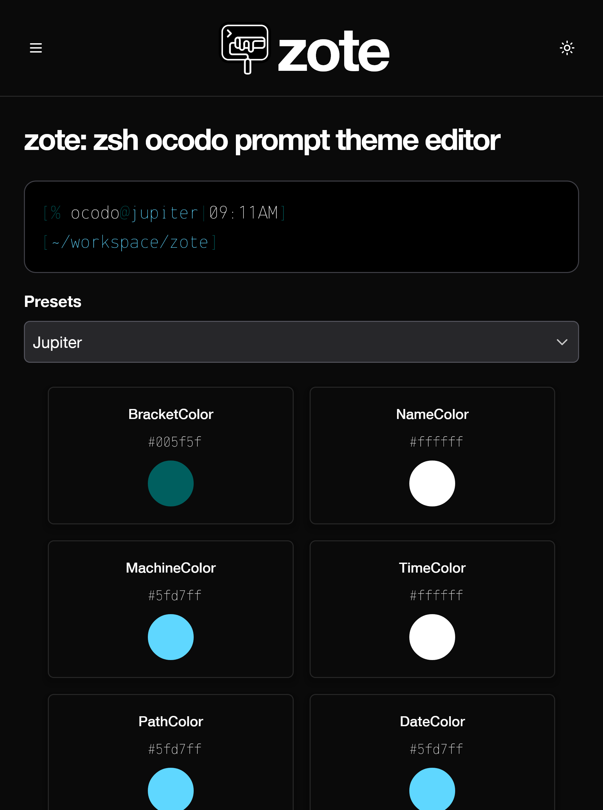

# ZOTE

**Z**sh **o**codo prompt **t**heme **e**ditor



- - -

# Install

Clone the repo and `cd zote` then:

`npm install`

#### Run / build / test

```
npx vite dev

npx vite build

npx vite preview

npx jest

npx eslint . --fix
```

- - -

Built with Vite and React


