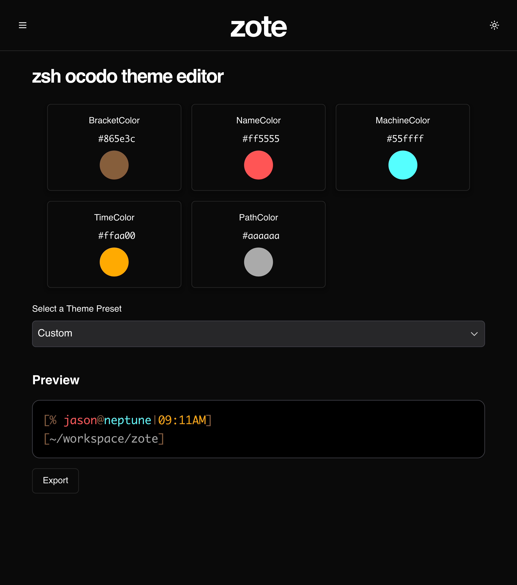
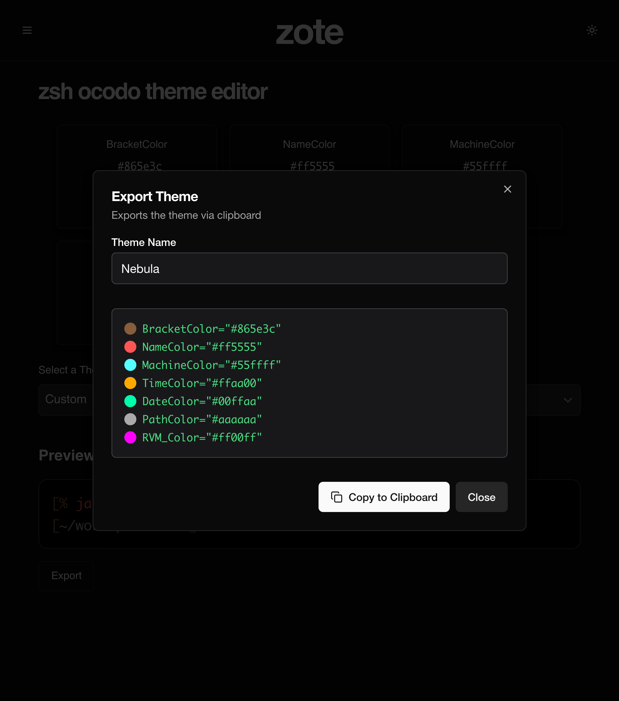

# ZOTE

**Z**sh **o**codo prompt **t**heme **e**ditor

## https://zote.hub





- - -

# Install

`npm install`

# Run

```
npx next -H 0.0.0.0 -p 78174
```

- - -

# Run as a service

Systemd service should run `bin/service.sh` with the working directory as the project root.

# Proxy forward

It's reverse proxy is in helios `/etc/lighttpd/conf-enabled/10-zote-rev-proxy.conf`

# DNS Entry

in https://pi.hole/admin/dns_records.php 

- - -


